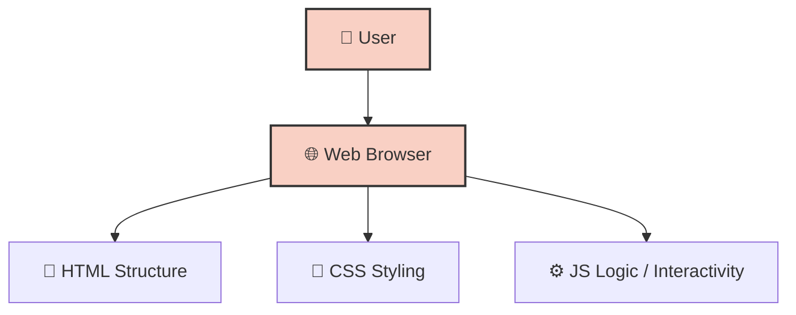

# 🌐 070921 - Web Application

A standard web application built with HTML, CSS, and JavaScript.

## 🚀 Overview

This repository contains the source code for **070921**. It serves as an example or functional implementation of its respective stack.

## 🛠 Technology Stack

- **Languages**: HTML5, CSS3, Vanilla JavaScript

## 🏗 Architecture / Workflow

## ⚙️ Usage

To run or view this project locally:
1. Clone the repository: `git clone https://github.com/iv150320/070921.git`
2. Open the project in your preferred environment.
3. For web apps, open the `index.html` file in a browser or serve it via a local web server (e.g. `npx serve` or Live Server).

---
**Author**: @iv150320
